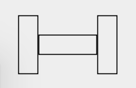
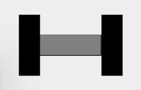
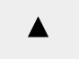
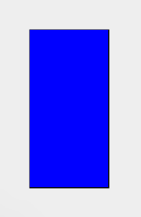

title: Formation Scala
author:
    name: Thomas GIOVANNINI
    github: https://github.com/Giovannini
    email: tgi@zengularity.com
style: style.css

output: slideshow.html

--

# Formation Scala
## Débutant

--

### Overview

TODO

--

### Why Scala ?
*A scalable programming language is one in which the same concepts can
describe small as well as large parts.*

**Martin Odersky**


--

### Scala en quelques mots
 - Langage de programmation généraliste
 - Orienté objet
 - Type statiquement
 - Multi-paradigme: programmation fonctionnelle et impérative

--

### Hello world
```
object Main extends App {
  println("Hello world!")
}
```

--

### Une syntaxe flexible
```
"The 'Hello world' string" should {
  "contain 11 characters" in {
    "Hello world" must have size 11
  }
}
```

--

### Une syntaxe flexible
```
class PingPong extends Actor {
  def receive = {
    case x => sender ! x
  }
}
```

--

### Une syntaxe flexible
```
class ExprParser extends RegexParsers {
  def factor = "[0-9]+".r | "("~expr~")"
  def term = factor~("*" | "/")~factor
  def expr = term~("+" | "-")~term
}
```

--

# Lançons-nous

--

### Read­-Eval-­Print Loop (REPL)
La façon la plus rapide d'essayer Scala est via la REPL:
```
$ sbt console
Welcome to Scala 2.11.8 (Java HotSpot(TM) 64-Bit
Server VM, Java 1.8.0_65).
Type in expressions for evaluation. Or try :help.

scala>
```
(Vérifier que [SBT](http://www.scala-sbt.org/) est installé sur le système.)

--

# Des valeurs et des types

--

### De quoi est fait un programme
- Un programme est l'expression d'une solution à un problème donné
- Nous avons besoin d'une façon d'exprimer et de se référer aux éléments du notre problème

--

### Les éléments les plus simple d'un programme: des valeurs litérales
*Quelle est la réponse à la vie, l'univers et le reste ?*
```
scala> 42
res0: Int = 42
```

*Comment est-ce que je m'appelle ?*
```
scala> "Thomas"
res1: String = Thomas
```

--

### Les éléments les plus simple d'un programme: des valeurs litérales
- *42* et *"Thomas"* sont des **valeurs** composées d'une unique **valeur litérale**.

--

### Composer des valeurs: les opérateurs
*Combien font deux et trois ?*
```
scala> 2 + 3
res2: Int = 5
```

*Quel est le résultat de la concaténation des chaînes de caractère "Hello " et "world" ?*
```
scala> "Hello " + "world"
res3: String = Hello world
```

--

### Composer des valeurs: les appels de méthode
*Quelle est la taille du texte "Hello world" ?*
```
scala> "Hello world".size
res4: Int = 11
```
- Les **méthodes** sont appliquées à des valeurs.

--

### Composer des valeurs: les appels de méthode
*Quel est le rang des nombres de 1 à 10 ?*
```
scala> 1.to(10)
res5: scala.collection.immutable.Range.Inclusive =
  Range(1, 2, 3, 4, 5, 6, 7, 8, 9, 10)
```
- Les **méthodes** peuvent avoir des paramètres. On les fournis entre parenthèses.

--

### Les opérateurs sont des méthodes
En réalité, les opérateurs sont juste des méthodes avec des noms symboliques.
```
scala> 3.+(2)
res6: Int = 5
```

--

### Les opérateurs sont des méthodes
La syntaxe infixe peut aussi être utilisée avec des méthodes non symboliques.
```
scala> 1 to 10
res7: scala.collection.immutable.Range.Inclusive =
  Range(1, 2, 3, 4, 5, 6, 7, 8, 9, 10
```

--

### Les opérateurs sont des méthodes
L'unification des méthodes et des opérateurs rendent le langage plus simple.

--

### Exercice
- Utiliser la méthode `abs` pour récupérer la valeur absolue de `-42`.
- Utiliser la méthode `toUpperCase` pour transformer le texte `Hello world!` en majuscules.

--

### Un niveau d'abstraction supplémentaire: les valeurs non littérales
Comment définir quelque chose de plus haut niveau comme des images ?
```
scala> Circle(10)
res8: doodle.core.Image.Circle = Circle(10.0)
```
`Circle` est un constructeur qui prend un paramètre (le rayon) et retourne un objet représentant un cercle.

--

### Manipuler les images
Afficher une image avec `draw`:
```
scala> Rectangle(30, 50).draw
```

--

### Manipuler les images
Mettre en page les images avec `beside`, `above`, `under` :
```
scala> Rectangle(60, 100) beside Circle(30)
res10: doodle.core.Image = Beside(
  Rectangle(60.0,100.0),Circle(30.0))
scala> res10.draw
```

--

### Types
Toutes les valeurs ont un **type**
- `42` a le type `Int`
- `"Thomas"` a le type `String`

Les types permettent de classifier les valeurs
- `0` et `42` sont du type `Int`

--

### Les types sont là pour nous guider
Les vérifications de type interdisent de combiner les valeurs d'une mauvaise façon
```
<console>:24: error: type mismatch;
 found   : String("10")
 required: Int
       1 to "10"
            ^
```

--

### Les types sont là pour nous guider
L'exécution d'un programme se fait en deux étapes:

- Le compilateur transforme le code Scala en bytecode Java
- La JVM exécute le bytecode

La vérification des types se fait lors de la première étape: les erreurs sont détectées rapidement.

--

### Des types communs
- `Int` : un entier signé de 32­bit
- `Double` : un flottant de 64­bit IEEE­754 (e.g. 12.34).
- `Boolean` : une valeur booléenne (true et false)
- `String` : texte

--

### L'absence de type
- Les méthodes comme `println` et `draw` ne retournent pas de valeur significative.
- A la place, elles exécutent des effets de bords (side-effect)
- Leur type de retour est `Unit`
- Il n'existe qu'une seule valeur possible pour `Unit`: `()`

--

### Exercice
Dessiner un point d'exclamation.


--

### Exercice
Dessiner une haltère.



--

### Manipuler les images avec des couleurs
On peut utiliser la commande `fillColor` pour remplir une `Image` avec une couleur.
```
(Rectangle(30, 80) fillColor Color.black).draw
```
On a par exemple accès aux couleurs `red`, `blue`, `green`, `black`, `white`, `gray` et `brown`.

--

### Exercice
Ajouter de la couleur à notre haltère.



--

# Les définitions
## Un outil contre la répétition

--

### Définitions de valeurs
Considérons le programme suivant:
```
(
  (Rectangle(25, 100) fillColor Color.black) beside
  (Rectangle(200, 20) fillColor Color.grey) beside
  (Rectangle(25, 100) fillColor Color.black)
).draw
```

- Il est compliqué à **lire** car l'expression est longue.
- Il est compliqué à maintenir puisque pour changer le poids de nos haltères, nous devons changer le code à deux endroits.

--

### Définitions de valeurs
```
val weight = Rectangle(25, 100) fillColor
  Color.black
val bar = Rectangle(200, 20) fillColor Color.grey

(weight beside bar beside weight).draw
```
Les deux premières lignes sont des **définitions de valeur**.
- Elles introduisent des **noms**.
- Elles **lient** ces noms aux valeurs à droite du `=`.

--

### Définitions de valeurs
```
val weight = Rectangle(25, 100) fillColor
  Color.black
val bar = Rectangle(200, 20) fillColor Color.grey

(weight beside bar beside weight).draw
```
Les noms ainsi créés peuvent être utilisés comme toute autre valeur.

Notons que le type est inféré par le compilateur.

--

### Définitions de valeurs
```
val weight = Rectangle(50, 100) fillColor
  Color.black
val bar = Rectangle(200, 20) fillColor Color.grey

(weight beside bar beside weight).draw
```
Changer le poids ne demande un changement qu'à un seul endroit.

--

### Exercice
Dessiner deux haltères une au dessus de l'autre.
L'une est légère, l'autre lourde.


--

### Le principe d'abstraction
<div class="quote">
  <p>
    Chaque fonctionnalité d'un programme ne doit être implémentée qu'à un seul endroit dans le code.
  </p>
  <p>
    Aux endroits où des fonctions similaires sont portées par des bouts de code différents, il est souvent bénéfique de les combiner en une seul, en abstrayant les parties variables.
  </p>
  <p class="author">
    Benjamin C. Pierce. Types and Programming Languages. MIT Press 2002.
  </p>
</div>

--

### Définitions de méthodes
```
val heavyWeight =
  Rectangle(30, 100) fillColor Color.black
val smallWeight =
  Rectangle(15, 100) fillColor Color.black
val bar = Rectangle(200, 20) fillColor Color.grey
```
Il existe beaucoup de similarités entre `heavyWeight` et `smallWeight`.
Il nous faudrait une façon de généraliser cela.

--

### Définitions de méthodes
```
def weight(width: Int) =
  Rectangle(width, 100) fillColor Color.black
val heavyWeight = weight(30)
val smallWeight = weight(15)
```
La première ligne est une définition de méthode. Contrairement à la définition de valeurs, elle peut avoir des paramètres.

--

### Définitions de méthodes
```
def weight(width: Int) =
  Rectangle(width, 100) fillColor Color.black
val heavyWeight = weight(30)
val smallWeight = weight(15)
```
Les paramètres sont spécifiés entre parenthèses et séparés par des virgules.

Le type des paramètres doit être donné explicitement.

--

### Exercice
Définir une méthode `barbell` qui prend en paramètre une image de poids et qui retourne l'image d'une haltère avec ce poids.

--

### Un résumé de la situation
Scala nous donne des moyens de:
- écrire des valeurs litérales représentant des **éléments simples** (`17`, `"Hello"`)
- *combiner* ces valeurs (via des méthodes)
- *abstraire* des expressions en introduisant un nom pour s'y référer

Ces moyens d'abstractions et de composition nous donnent un pouvoir d'expression pour généraliser des problèmes et les combiner.

--

### Exercice
Dessiner 5 haltères les unes au dessus des autres.

--

### Des boucles et des conditions
```
val unit = barbell(weight(15))
val barbell1 = unit
val barbell2 = unit above barbell1
val barbell3 = unit above barbell2
val barbell4 = unit above barbell3
val barbell5 = unit above barbell4
```
Pour construire `barbellN`, on rajoute `unit` au dessus de `barbellN-1`.

--

### Des boucles et des conditions
Pour généraliser cela, on veut exprimer quelque chose de la sorte:

`barbellN`:
- `unit` si n = 1
- `unit` above `barbellN-1` sinon

--

### Les conditions
```
val unit = barbell(weight(15))
def barbells(n: Int) =
  if (n == 1) unit
  else unit above ???
```
On peut écrire une expression conditionnelle en utilisant `if` et `else`.
Le résultat de cette expression dépend de la valeur booléenne qu'on lui donne.

--

### Les expressions booléennes
Les booléens littéraux sont `true` et `false`.

Il existe des opérateurs de comparaisons: `17 == 17`, `17 != 42`, `17 < 42`, ...

Les expressions booléennes peuvent être combinées avec les opérateurs `||` (disjonction), `&&` (conjonction) et `!` (négation).
```
true || false == !false
```

--

### Retour à notre problème
```
val unit = barbell(weight(15))
def barbells(n: Int) =
  if (n == 1) unit
  else unit above ???
```

--

### Les méthodes récursives
```
val unit = barbell(weight(15))
def barbells(n: Int): Image =
  if (n == 1) unit
  else unit above barbell(n-1)
```
Le type de retour pour une méthode récursive est obligatoire.

--

### Définitions de niveau supérieure et portée lexicale

--

### Définitions d'objets
Dans un programme Scala, les valeurs et méthodes doivent être définies dans une définition de niveau supérieure.

--

### Définitions d'objets
```
object Loops {
  def barbells(n: Int): Image = ???
}
```
Ce code contient une **définition d'objet** qui introduit le nom `Loops`.
`Loops` réfère à un objet qui possède une méthode: `barbells`.
On peut accéder à la méthode `barbells` en dehors en utilisant la notation par point: `Loops.barbells(17)`.

--

### Packages
```
package core
object Loops { ... }
```

```
package std
object Lists { ... }
```
Les définitions d'objets peuvent être organisées en *packages*.

--

### Visibilité entre packages
```
package core
object Loops {
  def barbells(n: Int): Image = ???
}
```
___
```
package core
object Definition {
  Loops.barbells(17)
}
```
Les noms définis dans un package sont visibles dans le code défini dans le même package.

--

### Visibilité entre packages
```
package core
object Loops {
  def barbells(n: Int): Image = ???
}
```
___
```
package std
object Definition {
  core.Loops.barbells(17)
}
```
Les noms définis dans un package ne sont pas visibles dans le code défini dans un autre package. Ils doivent être **entièrement qualifiés** pour être résolus par le compilateur.

--

### Imports
```
package std

import core.Loops

object Definition {
  Loops.barbells(17)
}
```
Le mot clef `import` permet d'accéder aux noms sans devoir les qualifier.

--

### Blocs et définitions locales
```
def barbells(n: Int): Image = {
  val unit = barbell(weight(15))
  if (n == 1) unit
  else unit above barbells(n - 1)
}
```
Les valeurs et méthodes peuvent aussi être définies dans un **bloc**. Ces définitions ne sont pas accessibles en dehors.

--

### Exercice
Créer une méthode `sierpinski` qui prend en paramètre un entier `n` et qui retourne l'image d'un trianle comme suit:



--

### Modèle d'évaluation
```
val foo = 1 + 1
def bar = 1 + 1
```
Quelle est la différence entre `foo` et `bar` ?

--

### Modèle d'évaluation
```
val foo = 1 + 1
def bar = 1 + 1
```
- La première est évaluée une seuls fois, au moment de la définition. `foo` réfère donc à l'expression `2`.
- La seconde est évaluée à chaque fois qu'elle est appelée. `bar` réfère donc à l'expression `1 + 1`.

--

### Terminaison
```
def loop: Nothing = loop
```
Est-on certain qu'un programme va se terminer ?

--

### Ecrire un programme autonome

--

### Ecrire un programme autonome
Ecrivons le programme suivant dans un `Main.scala`:
```
object Main extends App {
  println("Hello world!")
}
```

--

### Ecrire un programme autonome
Compilons-le:
```
$ scalac Main.scala
```

Lançons-le:
```
$ scala Main
Hello world!
```

--

### Scaling le processus de build
- Que se passe-t-il si le programme a 100 fichiers sources ?
- Comment faire pour ne recompiler que les sources impactées par un changement donné ?
- Que faire si le projet dépend d'une librairie tierce ?
- Comment gérer le cycle de vie entier du projet (tests, packaging, publication, etc) ?

--

### SBT
[SBT](http://www.scala-sbt.org/) est un outil de build pour des projets Scala.

--

### SBT: Getting started
- Lancer `$ sbt` depuis le répertoire du projet pour ouvrir le prompt SBT
- Ecrire `$ sbt <commande>` depuis le répertoire du projet pour lancer une commande SBT
depuis le terminal.
  - `run` pour lancer le projet
  - `console` pour ouvrir un REPL dans le contexte du projet
  - `test` pour lancer les tests du projet
  - `compile` pour compiler le projet, sans le lancer

--

### SBT: Getting started
Le processus de build du projet est défini dans un fichier `build.sbt`.
Il défini essentiellement les **paramètres** du projet.
```
name := "scala-course"

scalaVersion := "2.11.8"

libraryDependencies +=
  "com.chuusai" %% "shapeless" % "2.3.0"
```
Les valeurs de paramètre sont des expressions Scala.

--

### Modéliser le monde

--

### Modéliser le monde
Considérons la méthode suivante qui créé une haltère:
```
def barbell(load: Int, length: Int): Image = {
  val weight =
    Rectangle(load, 100) fillColor Color.black
  val bar =
    Rectangle(length, 20) fillColor Color.grey
  weight beside bar beside weight
}
val lightBarbell = barbell(10, 180)
val heavyBarbell = barbell(20, 200)
```
On ne peut pas faire grand chose d'autre que de la dessiner.

--

### Modéliser le monde
Comment, par exemple, définir une haltère qui est plus lourde qu'une autre ?
```
def weigh(barbell: Image): Image = ???
```
Modéliser les haltères comme des images les rend compliqués à manipuler.

--

### Modéliser le monde
```
def weighLoad(load: Int) = load + 10
def weighLength(length: Int) = length + 20

val lightBarbellLoad = 10
val lightBarbellLength = 180

val heavyBarbellLoad = weighLoad(lightBarbellLoad)
val heavyBarbellLength = weighLength(lightBarbellLength)
```
Il s'agit d'une approche assez compliqué d'utilisation...

--

### Les case class
```
case class Barbell(load: Int, length: Int) {
  def weigh: Barbell = Barbell(load + 10, length + 20)
}

val lightBarbell = Barbell(10, 180)
val heavyBarbell = lightBarbell.weigh
```
Ce code contient une définition de **case class**, qui introduit:
- le **type** `Barbell`
- le **constructeur** `Barbell`

--

### Les case class
```
case class Barbell(load: Int, length: Int) {
  def weigh: Barbell = Barbell(load + 10, length + 20)
}

val lightBarbell = Barbell(10, 180)
val heavyBarbell = lightBarbell.weigh
```
Le type `Barbell` a trois membres: `load`, `length`, et `weigh`.
`lightBarbell` et `heavyBarbell` sont des **instances** de `Barbell`.

--

### Exercice
Implémenter la fonction
```
def barbellImage(barbell: Barbell): Image = ???
```

--

### Exercice
Une haltère est un moyen de musculation.
Considérons un autre outil:



Un matelas a une largeur et une longueur. Définissons une `case class` pour lui.

--

### Exercice
Disons qu'il n'existe dans notre monde que ces deux moyen de se muscler.
Comment écrire une fonction `fitnessDeviceImage` qui prend en paramètre un de ces moyens en
paramètre et qui retourne une image de celui-ci ?

--

### Sealed trait
Comment exprimer le fait qu'un moyen de musculation peut être un matelas, une haltère et
rien d'autre ?
```
sealed trait FitnessDevice
case class Barbell(load: Int, length: Int) extends FitnessDevice
case class Mat(width: Int, length: Int) extends FitnessDevice
```
Ce code contient la définition d'un **sealed trait**, qui introduit le **type** `FitnessDevice`.

Les définitions de `case class` qui étendent `FitnessDevice` définissent les variantes possibles
de `FitnessDevice`.

--

### Sealed trait
Comment exprimer le fait qu'un moyen de musculation peut être un matelas, une haltère et
rien d'autre ?
```
sealed trait FitnessDevice
case class Barbell(load: Int, length: Int) extends FitnessDevice
case class Mat(width: Int, length: Int) extends FitnessDevice
```

*Les variantes d'un `sealed trait` doivent se trouver dans le même fichier source.*

--

### Pattern matching
Il est possible de manipuler les `case classes` et les `sealed trait` en utilisant
le **pattern matching**.
```
def name(fitnessDevice: FitnessDevice): String =
  fitnessDevice match {
    case Barbell(load, length) => "Barbell"
    case Mat(width, length) => "Mat"
  }
```

--

### Exercice
Ecrire une fonction `fitnessDeviceImage` qui prend en paramètre un de ces moyens en
paramètre et qui retourne une image de celui-ci.

--

### Modéliser le monde
La combinaison de `case class` et de `sealed trait` donne un moyen pratique de modéliser
l'information en terme de relation **est** ou **a**:
- "un moyen de musculation **est** une haltère ou un matelas"
  - *Le sealed trait FitnessDevice est étendu par Barbell et Mat*
- "une haltère **a** un poids et une longueur"
  - *La case class Barbell a les membres load et length*

--

### Exercice
Modéliser le domaine suivant en Scala:
- Une forme géométrique est soit un cercle, soit un rectanle, soit un triangle
- Un cercle a un rayon
- Un rectange a une longueur et une largeur
- Un triangle a une longueur et une hauteur

--

### Exercice
Modéliser le domaine suivant en Scala:
- Un cours a un nom et un niveau de difficulté
- Un niveau de difficulté est soit "Débutant", "Intermédiaire" ou "Avancé"

Peut-on définir un cours appelé "Programmer en Scala" destiné aux débutants ?

--

### Case objects
```
sealed trait DifficultyLevel
case class Beginner() extends DifficultyLevel
case class Intermediate() extends DifficultyLevel
case class Advanced() extends DifficultyLevel
```
Si une `case class` n'a pas de paramètre, on utilise un `case object` à la place:
```
sealed trait DifficultyLevel
case object Beginner extends DifficultyLevel
case object Intermediate extends DifficultyLevel
case object Advanced extends DifficultyLevel
```

--

### Collections standard

--

### Collections standard
La librairie standard de Scala propose différents types pour rendre la manipulation de collections
d'éléments plus simple.

Cette section donne une idée rapide de ces collections standard.
Pour plus de détails, aller sur la [documentation de l'API](http://www.scala-lang.org/api/current/scala/collection/index.html).

--

### Collections standard
On peut créer une séquence d'objets avec `Seq`:
```
val numbers = Seq(1, 5, 3, 17)
val numbers: Seq[Int] = Seq(1, 5, 3, 17)
val numbers2 = Seq.empty[Int]
```

--

### Collections standard
On peut ajouter un élément au début d'une séquence avec l'opérateur `+:`:
```
0 +: numbers
```
On peut ajouter un élément au début d'une séquence avec l'opérateur `:+`:
```
numbers :+ 42
```

Ces fonctions **retournent une nouvelle séquence** et ne modifient pas l'objet initial.

--

### Collections standard
Il est possible d'utiliser le pattern matching sur une séquence:
```
def size(numbers: Seq[Int]): Int = numbers match {
  case Nil => 0
  case n +: numbersTail => 1 + size(numbersTail)
}
```

--

### Exercice
Définir une méthode `stack` qui prend en paramètre une séquence d'images et qui
retourne une image qui les empile les unes sur les autres:
```
def stack(images: Seq[Image]): Image = ???
```

--

### Exercice
Définir une méthode `largeEnough` qui prend en paramètre une séquence de matelas et qui retourne
leurs aires uniquement si elles sont plus grandes que 1000:
```
def largeEnough(mats: Seq[Mat]): Seq[Int] = ???
```

--

### map
Il est possible de transformer tous les éléments d'une séquence en utilisant `map`.
```
val areas: Seq[Int] =
  mats.map(mat => mat.width * mat.length)
```
**`map`** prend en paramètre une fonction et retourne une séquence avec des éléments qui sont le
résultat de la fonction appliqué à chaque élément de la séquence.

--

### filter
Il est possible de filtrer les éléments d'une séquence en utilisant `filter`.
```
val largerThanOneHundred: Seq[Int] =
  mats.filter(mat => mat.width > 100)
```
**`filter`** prend en paramètre une fonction qui retourne un booléen et retourne une séquence
avec uniquement les éléments qui satisfont ce prédicat.

--

### Exercice
Réécrire `largeEnough` en utilisant `map` et `filter`.

--

### flatMap
Parfois, la fonction que l'on passe à `map` retourne aussi une `Seq`.
```
val duplicates(numbers: Seq[Int]) =
  numbers.map(n => Seq(n, n))
```

--

### flatMap
Il est possible d'applatir notre résultat en utilisant la fonction `flatMap`:
```
val duplicates(numbers: Seq[Int]): Seq[Int] =
  numbers.flatMap(n => Seq(n, n))
```

--

### foreach
Il est possible d'appliquer un effet de bord à notre séquence d'éléments en utilisant `foreach`:
```
val drawAll(images: Seq[Images]): unit =
  images.foreach(images => image.draw)
```

--

### Traversable
Il s'agit de la collection la plus générale et propose des méthodes permettant d'itérer sur les
éléments d'une collection, de les transformer, les filtrer, ...

--

### Iterable
`Iterable[A]` étend de `Traversable[A]` et ajoute quelques méthodes comme `zip` ou `grouped`.
```
scala> val zipped = Iterable(1, 2, 3) zip Iterable(4, 5, 6)
zipped: Iterable[(Int, Int)] = List((1,4), (2,5), (3,6))
```

--

### Seq
`Seq[A]` est un `Iterable[A]` dans lequel l'ordre des éléments est conservé.
Il ajoute quelques méthodes comme `reverse`, `sorted`.

--

### List et Vector
`List[A]` et `Vector[A]` sont deux implémentation de `Seq[A]` avec des caractéristiques de
performances différentes.
- `List[A]` a des implémentations de `head` et `tail` plus performantes
- `Vector[A]` a des implémentations de `get` et `size` plus performantes


--

### Range, Set et Map
- `Range` est une implémentation de `Seq[Int]` qui permet de représenter une plage d'entiers.
- `Set[A]` est un `Iterable[A]` qui ne contient aucun élément dupliqué.

--

### Gestion des erreurs

--

### Gestion des erreurs: pourquoi ?
Prenons la méthode suivante:
```
def lighten = Barbell(load - 10, length - 20)
```
Que se pass-t-il si les valeurs de `load` ou `length` deviennent nulles ou négatives ?
Souhaite-t-on que `lighten` soit définie pour toutes les valeurs de `Barbell` ?

--

### Option
Un moyen de modéliser le fait qu'une haltère puisse ne pas avoir d'haltère plus légère est
d'utiliser le type `Option`.
```
def lighten: Option[Barbell] =
  if (load <= 15 || length <= 100) None
  else Some(Barbell(load - 10; length - 20))
```
La librairie standard définie le type `Option[A]` qui modélise une potentielle valeur du type `A`.

--

### Option
```
def lighten: Option[Barbell] =
  if (load <= 15 || length <= 100) None
  else Some(Barbell(load - 10; length - 20))
```
Une `Option[A]` peut être soit:
- `Some(a)`
- `None`

--

### Exercice
Ajouter une méthode `smaller` à notre type `Mat`:
```
def smaller: Option[Map] = ???
```

--
### Utilisations communes des valeurs optionnelles
On peut utiliser le pattern matching:
```
def smallerMat(mat: Mat): String =
  mat.smaller match {
    case Some(mat) => "There is a smaller mat."
    case None => "There is no smaller mat."
  }
```
--
### Utilisations communes des valeurs optionnelles
Il est possible d'utiliser `map` pour transformer une valeur pleine en une autre valeur pleine,
en ignorant le cas `None`:
```
def smallerWidth(mat: Mat): Option[Int] =
  mat.smaller.map(smallerMat => smallerMat.width)
```
--
### Utilisations communes des valeurs optionnelles
Il est possible d'utiliser `filter` pour transformer une valeur pleine en une valeur vide, si le
contenu ne satisfait pas le prédicat.
```
def keepHugeMats(maybeMat: Option[Mat])
: Option[Mat] = mat.filter(mat =>
  mat.width > 100 && mat.length > 200)
```
--
### Exercice
Ecrire une fonction qui prend en paramètre un matelas, essaye de créer un matelas plus petit et
qui retourne sont aire si elle est plus grande que 1000:
```
def smallerButLargeEnough(mat: Mat)
: Option[Int] = ???
```
--
### Utilisations communes des valeurs optionnelles
Il est possible d'utiliser `flatMap` pour applatir notre résultat:
```
def smallerSmaller(mat: Mat): Option[Mat] =
  mat.smaller.flatMap(smallerMap =>
    smallerMat.smaller)
```
--
### Séquencer des calculs en manipulant des valeurs optionnelles
Les méthodes `flatMap` et `map` peuvent être utilisées:
```
def lightenLightenLoad(barbell: Barbell): Option[Int] =
  barbell.lighten.flatMap { lighterBarbell =>
    lighterBarbell.lighten.map {
      lighterLighterBarbell =>
        lighterLighterBarbell.load
    }
  }
```
--
### Try
`Try[A]` est similaire à `Option[A]`, à l'exception du fait qu'en cas d'erreur, il offre
plus d'information. Il peut être:
- Success(a)
- Failure(throwable)
--
### Try
Tout comme `Option[A]`, `Try[A]` a accès aux fonctions `map`, `filter` ou `flatMap`.
--
### Sucre syntaxique
--
### Interpolation de string
Il s'agit d'un mécanisme pour construire des chaînes de caractères de façon dynamique:
```
def greet(name: String) = s"Hello, $name!"
```
Il suffit de préfixer la valeur littérale par un `s`.
A l'intérieur de la chaîne, il siffit d'utiliser `$` pour insérer une valeur.
--
### Séquençage de `map` et `flatMap`
Nous avons vu précédemment que `map` et `flatMap` sont des fonctions très utiles qui permettent de
séquencer des calculs dans un contexte donné (valeurs optionnelles, collections).

Elles sont si communes que Scala supporte une syntaxe plus pratique pour les utiliser, la **for
comprehension**.
--
### Séquençage de `map` et `flatMap`
```
def lightenLightenLoad(barbell: Barbell) =
  barbell.lighten.flatMap { lighterBarbell =>
    lighterBarbell.lighten.map {
      lighterLighterBarbell =>
        lighterLighterBarbell.load
    }
  }
```
Peut être réécrit comme suit:
```
def lightenLightenLoad( barbell: Barbell ) = for {
  lighterBarbell <- barbell.lighten
  lighterLighterBarbell <- lighterBarbell.lighten
} yield lighterLighterBarbell.load
```
--
### Traduction de `for`
```
for (x <- xs) yield x + 1
```
est traduit en
```
xs.map(x => x + 1)
```
--
### Traduction de `for`
```
for (x <- xs; y <- ys) yield (x, y)
```
est traduit en
```
xs.flatMap(x => for (y <- ys) yield (x, y))
```
--
### Traduction de `for`
```
for (x <- xs if x % 2 == 0) yield x + 1
```
est traduit en
```
for (x <- xs.filter(x => x % 2 == 0)) yield x + 1
```
--
### Fonction littérales
Dans certains cas, nous aimerions éviter de répéter le nom du paramètre littéral d'une fonction.
```
val inc: Int => Int = x => x + 1
```
Il est possible de simplifier cette expression en utilisant la notation underscore:
```
val inc: Int => Int = _ + 1
```
Si la fonction prend plusieurs paramètres, il est possuble d'utiliser autant de underscrores que
de paramètres:
```
def sum(xs: Seq[Int]) = xs.foldLeft(0)(_ + _)
```
--
### Tuples
Les classes permettent de combiner plusieurs valeurs ensemble.
Il arrive que l'on souhaite aggréger plusieurs valeurs dans définir de méthode particulières.
Dans de tels cas, définir une classe supplémentaire est quelque chose de lourd. Il est possible
d'utiliser des **tuples** à la place:
```
def euclideanDiv(dividend: Int, divisor: Int): (Int, Int) = {
  val quotient = dividend / divisor
  val remainder = dividend % divisor
  (quotient, remainder)
}
```
--
### Tuples
- Le type `(T1, ..., Tn)` est un type de tuple à n éléments, avec le ie élément ayant le type `Ti`.
- La valeur `(t1, ..., tn)` est une valeur d'un tuple à `n` éléments.
--
### Tuples
Pour récupérer le ieme élément d'un tuple, on utilise la notation `_i`:
```
val qr = euclidianDiv(42, 10)
pritln(qr._1)
pritln(qr._2)
```
On peut aussi utiliser le `tuple pattern` pour déstructurer un tuple:
```
val (q, r) = euclidianDiv(42, 10)
```
--
### Named parameters
```
Range(1, 10, 2)
```
Il est parfois compliqué de se rendre compte de ce que fait une fonction simplement en la lisant.
Il est ainsi possible d'utiliser les `named parameters` pour améliorer la lisibilité:
```
Range(start = 1, end = 10, step = 2)
```
--
### Arguments par défaut
```
def square(size: Int = 50) = Rectangle(size, size)
val defaultSquare = square()
// Rectangle(50, 50)

val customSquare = square(100)
// Rectangle(100, 100)
```
--
### Paramètres répétés
```
def stack(images: Image*): Image =
  images.foldLeft(emptyImage)(_ on _)
stack(Circle(50))
stack(Circle(50), Rectangle(50, 50))
```

```
val images = Seq(Circle(50), Circle(60))
stack(images: _*)
```
--

# Projet
## Le jeu de la vie

--

### Le jeu de la vie
* https://en.wikipedia.org/wiki/Conway%27s_Game_of_Life

`git clone git@github.com:Giovannini/gameoflife.git`

--

### Référénces et lectures recommandées
- **Creative Scala** Underscore Consulting LLP.
- **Functional Programming in Scala** Paul Chiusano and Rúnar Bjarnason. Manning 2013.
- **Programming in Scala** Martin Odersky, Lex Spoon and Bill Venners.
Artima 2010
